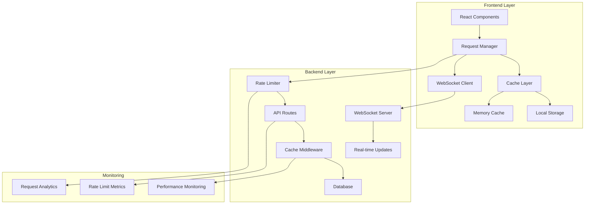

# Design Document

## Overview

This design addresses the rate limiting issues in the Alumni Management Dashboard by implementing a comprehensive solution that includes frontend request optimization, backend rate limit adjustments, intelligent caching, and improved error handling. The solution focuses on reducing unnecessary API calls while maintaining real-time data updates and excellent user experience.

## Architecture

### High-Level Architecture



### Request Flow Optimization

1. **Request Deduplication**: Multiple components requesting the same data will share a single API call
2. **Intelligent Caching**: Multi-layer caching with TTL and background refresh
3. **Rate-Aware Scheduling**: Requests are queued and scheduled to respect rate limits
4. **WebSocket Fallback**: Real-time updates via WebSocket with polling fallback

## Components and Interfaces

### Frontend Components

#### 1. Request Manager Service

```typescript
interface RequestManager {
  // Core request methods
  get<T>(url: string, options?: RequestOptions): Promise<T>;
  post<T>(url: string, data: any, options?: RequestOptions): Promise<T>;
  put<T>(url: string, data: any, options?: RequestOptions): Promise<T>;
  delete<T>(url: string, options?: RequestOptions): Promise<T>;
  
  // Cache management
  invalidateCache(pattern: string): void;
  getCacheStats(): CacheStats;
  
  // Rate limit handling
  isRateLimited(): boolean;
  getRetryAfter(): number;
}

interface RequestOptions {
  cache?: boolean;
  cacheTTL?: number;
  priority?: 'high' | 'medium' | 'low';
  retryOnRateLimit?: boolean;
  deduplicate?: boolean;
}
```

#### 2. Cache Layer

```typescript
interface CacheLayer {
  get<T>(key: string): Promise<T | null>;
  set<T>(key: string, value: T, ttl?: number): Promise<void>;
  invalidate(pattern: string): Promise<void>;
  clear(): Promise<void>;
  
  // Background refresh
  refreshInBackground<T>(key: string, fetcher: () => Promise<T>): Promise<T>;
}

interface CacheConfig {
  defaultTTL: number;
  maxSize: number;
  persistToStorage: boolean;
  backgroundRefresh: boolean;
}
```

#### 3. WebSocket Client

```typescript
interface WebSocketClient {
  connect(): Promise<void>;
  disconnect(): void;
  subscribe(channel: string, callback: (data: any) => void): void;
  unsubscribe(channel: string): void;
  
  // Connection management
  isConnected(): boolean;
  getConnectionState(): ConnectionState;
  
  // Fallback to polling
  enablePollingFallback(interval: number): void;
  disablePollingFallback(): void;
}
```

### Backend Components

#### 1. Enhanced Rate Limiter

```typescript
interface EnhancedRateLimiter {
  // Different limits for different endpoint types
  generalLimit: RateLimitConfig;
  dashboardLimit: RateLimitConfig;
  authLimit: RateLimitConfig;
  
  // User-specific limits
  getUserLimit(userId: string): RateLimitConfig;
  setUserLimit(userId: string, config: RateLimitConfig): void;
  
  // Monitoring
  getUsageStats(userId?: string): UsageStats;
  resetUserLimit(userId: string): void;
}

interface RateLimitConfig {
  windowMs: number;
  max: number;
  skipSuccessfulRequests?: boolean;
  skipFailedRequests?: boolean;
  keyGenerator?: (req: Request) => string;
}
```

#### 2. Cache Middleware

```typescript
interface CacheMiddleware {
  // Response caching
  cacheResponse(key: string, data: any, ttl: number): Promise<void>;
  getCachedResponse(key: string): Promise<any | null>;
  
  // Cache invalidation
  invalidatePattern(pattern: string): Promise<void>;
  invalidateUser(userId: string): Promise<void>;
  
  // Cache warming
  warmCache(endpoints: string[]): Promise<void>;
}
```

#### 3. WebSocket Server

```typescript
interface WebSocketServer {
  // Connection management
  handleConnection(socket: WebSocket, userId: string): void;
  handleDisconnection(socket: WebSocket): void;
  
  // Broadcasting
  broadcast(channel: string, data: any): void;
  broadcastToUser(userId: string, data: any): void;
  
  // Channel management
  subscribeToChannel(socket: WebSocket, channel: string): void;
  unsubscribeFromChannel(socket: WebSocket, channel: string): void;
}
```

## Data Models

### Cache Entry Model

```typescript
interface CacheEntry {
  key: string;
  value: any;
  createdAt: Date;
  expiresAt: Date;
  accessCount: number;
  lastAccessed: Date;
  tags: string[];
}
```

### Rate Limit Entry Model

```typescript
interface RateLimitEntry {
  identifier: string; // IP or user ID
  endpoint: string;
  requestCount: number;
  windowStart: Date;
  windowEnd: Date;
  isBlocked: boolean;
  retryAfter?: Date;
}
```

### Request Analytics Model

```typescript
interface RequestAnalytics {
  endpoint: string;
  method: string;
  userId?: string;
  ip: string;
  timestamp: Date;
  responseTime: number;
  statusCode: number;
  cacheHit: boolean;
  rateLimited: boolean;
}
```

## Error Handling

### Rate Limit Error Handling

1. **Frontend Error Handling**:
   - Detect 429 status codes
   - Parse retry-after headers
   - Implement exponential backoff
   - Show user-friendly messages
   - Queue requests for retry

2. **Backend Error Responses**:
   ```typescript
   interface RateLimitError {
     error: {
       message: string;
       code: 'RATE_LIMIT_EXCEEDED';
       retryAfter: number;
       limit: number;
       remaining: number;
       resetTime: string;
     }
   }
   ```

### Cache Error Handling

1. **Cache Miss Handling**:
   - Graceful degradation to API calls
   - Background cache warming
   - Stale-while-revalidate strategy

2. **Cache Corruption Handling**:
   - Automatic cache invalidation
   - Fallback to fresh data
   - Error logging and monitoring

## Testing Strategy

### Unit Tests

1. **Request Manager Tests**:
   - Request deduplication
   - Cache hit/miss scenarios
   - Rate limit handling
   - Error recovery

2. **Cache Layer Tests**:
   - TTL expiration
   - Background refresh
   - Memory management
   - Persistence

3. **Rate Limiter Tests**:
   - Different limit configurations
   - User-specific limits
   - Window sliding
   - Reset functionality

### Integration Tests

1. **End-to-End Request Flow**:
   - Dashboard loading scenarios
   - Rate limit recovery
   - WebSocket fallback
   - Cache invalidation

2. **Performance Tests**:
   - Concurrent request handling
   - Cache performance
   - Memory usage
   - Rate limit accuracy

### Load Tests

1. **Rate Limit Stress Tests**:
   - Burst request scenarios
   - Sustained high load
   - Multiple user simulation
   - Recovery testing

2. **Cache Performance Tests**:
   - Cache hit ratio optimization
   - Memory usage under load
   - Background refresh performance
   - Storage persistence

## Implementation Phases

### Phase 1: Backend Rate Limit Optimization
- Adjust rate limit configurations
- Implement user-specific limits
- Add detailed logging and monitoring
- Create rate limit analytics

### Phase 2: Frontend Request Management
- Implement request manager service
- Add request deduplication
- Create intelligent retry logic
- Build user feedback system

### Phase 3: Caching Layer
- Implement multi-layer caching
- Add background refresh
- Create cache invalidation strategies
- Build cache analytics

### Phase 4: Real-time Updates
- Implement WebSocket server
- Create WebSocket client
- Add polling fallback
- Build channel management

### Phase 5: Monitoring and Analytics
- Create request analytics
- Build performance dashboards
- Add alerting system
- Implement optimization recommendations

## Performance Considerations

### Frontend Optimizations

1. **Request Batching**: Combine multiple requests into single calls where possible
2. **Lazy Loading**: Load data only when needed
3. **Virtual Scrolling**: For large data sets
4. **Component Memoization**: Prevent unnecessary re-renders

### Backend Optimizations

1. **Database Indexing**: Optimize queries for analytics endpoints
2. **Connection Pooling**: Efficient database connections
3. **Response Compression**: Reduce payload sizes
4. **CDN Integration**: Cache static assets

### Caching Strategies

1. **Stale-While-Revalidate**: Serve stale data while fetching fresh data
2. **Cache Warming**: Pre-populate cache with frequently accessed data
3. **Intelligent Invalidation**: Smart cache invalidation based on data relationships
4. **Distributed Caching**: Scale caching across multiple instances

## Security Considerations

### Rate Limiting Security

1. **IP-based Limits**: Prevent abuse from single IPs
2. **User-based Limits**: Prevent abuse from authenticated users
3. **Endpoint-specific Limits**: Different limits for different sensitivity levels
4. **Bypass Protection**: Prevent rate limit bypass attempts

### Cache Security

1. **Data Isolation**: Ensure users can't access cached data from other users
2. **Sensitive Data**: Don't cache sensitive information
3. **Cache Poisoning**: Prevent malicious cache entries
4. **Encryption**: Encrypt cached data at rest

### WebSocket Security

1. **Authentication**: Verify user identity for WebSocket connections
2. **Authorization**: Ensure users can only access authorized channels
3. **Rate Limiting**: Apply rate limits to WebSocket messages
4. **Connection Limits**: Limit concurrent connections per user